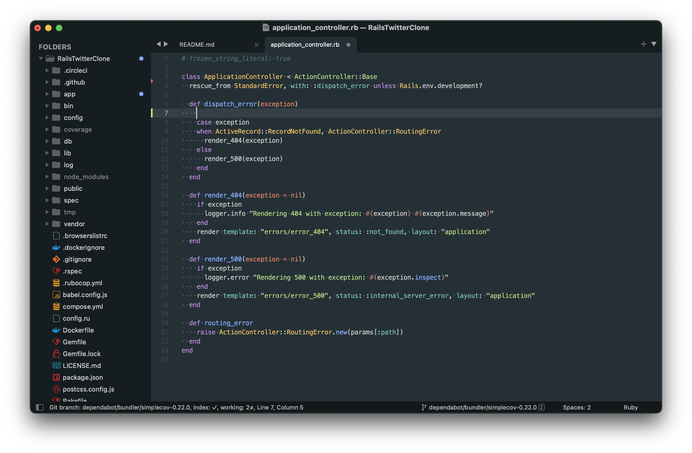

# Wakame for Sublime Text

Wakame Color Scheme for Sublime Text 3/4.

### Settings in the above image

* Sublime Text 4
* Color Scheme: Wakame
* Theme: Adaptive
* Icon: [A File Icon](https://github.com/SublimeText/AFileIcon)

## Installation

- Press `cmd/ctrl` + `shift` + `p` to open the command palette
- Type `install package` and press enter
- Then, search for **"Wakame"**

## Inspired Projects

- [SublimeText/material-theme](https://github.com/SublimeText/material-theme)
- [material-theme/vsc-material-theme](https://github.com/material-theme/vsc-material-theme)
